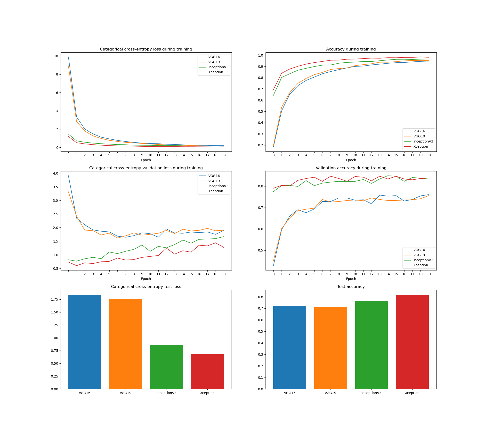
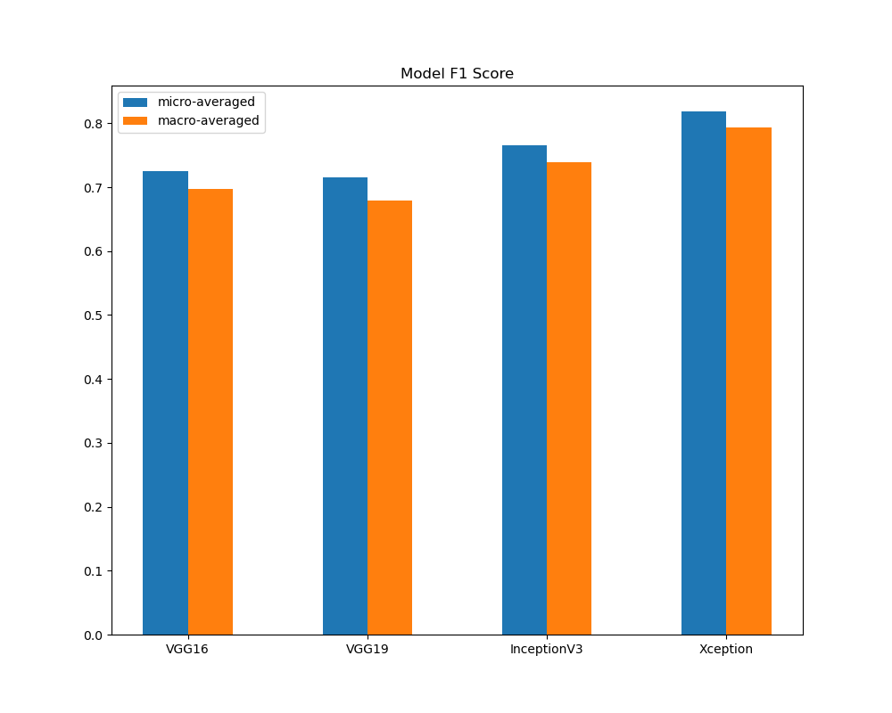

# Udacity-Dog-Project

TODO: web app, show accuracy on training/validation/test data sets (filter by dog breed)

## Project Definition
This project was created as part of Udacity's [Data Scientist](https://www.udacity.com/school/data-science) nanodegree program. Computer vision is a field that has greatly benefitted from deep learning. This project looks at identifying and classifying dog breeds from real-world images using convolution neural networks (CNNs). Udacity has provided a [starting template](https://github.com/udacity/dog-project) with guidance that this project builds on.

This project contains a Jupyter notebook that walks through the process of building a CNN to classify dog breed given an image: first from scratch, then using transfer learning on a pre-trained network. The final section of this notebook shows a pipeline that takes in an image. If a dog is detected, the code will predict the dog's breed; if a human is detected, the code will identify the resembling dog breed. There is another notebook that generates charts for accuracy and categorical cross-entropy loss for various trained models during training, validation, and testing. Finally, a dash web application was built to explore each model's performance on the test dataset and provide the opportunity to test each model on user-supplied images.

## Analysis
Four different models were trained using transfer learning on networks that were pre-trained on the ImageNet database: *VGG16*, *VGG19*, *InceptionV3* and *Xception*. The image below shows the accuracy ($\text{\# of correct predictions} / \text{\# of total predictions}$) and categorical cross-entropy loss (also known as softmax loss) on the train/validation sets during training, then on the test set.



The model performance metric of choice for a multiclass classification problem is **F1 score** (balanced F-score), which is the harmonic mean of precision and recall. In a multiclass scenario, the F1 score can be *micro-averaged* (samples weighted equally) or *macro-averaged* (classes weighted equally). The chart below shows both averages for each model on the test dataset.



## Conclusion
Overall, the models trained with *InceptionV3* and *Xception* performed best, even having a head start over the other two during training. This could mean that these pre-trained networks were already better-equipped to differentiate between dog breeds than the others. One factor that could play a role in model performance is network depth. In this transfer learning implementation, the transfer learning model added an extra dense layer if the pre-trained network bottleneck feature size was large (>512). More details on the implementation and explanation can be found in [the working notebook](dog_app.ipynb).

A potential improvement to be made would be to see if further training could yield better improvements to the *VGG16* and *VGG19* trained models to potentially catch up in performance to the current leaders. Also, it would be an interesting to see if the extra dense layer had a significant effect on the final performance of the *InceptionV3* and *Xception* models and if the other models could be brought to their level by adding that extra layer.

## Files
The main files of interest for this project are:
- [dog_app.ipynb](dog_app.ipynb) contains the working code to train and save the CNNs, as well as sections on detecting human faces and dogs in general on images.
- [model_stats.ipynb](model_stats.ipynb) goes through all of the model statistics and performances. It also produces and saves a dataframe of test set predictions for all models in [model_preds.df](model_preds.df).
- The [app](app) directory contains the web application code with entrypoint [app.py](app/app.py)

## Instructions
It is recommended to use Anaconda for this project. A [requirements.txt](requirements.txt) has been generated for use. To set up the conda environment, go to the project directory and use the command ```conda create -n dog_env --file requirements.txt```.

To run the notebooks, I recommend following the instructions on the [Udacity project](https://github.com/udacity/dog-project) to download the necessary datasets and bottleneck features as well as setting up TensorFlow.

To run the web application, activate your conda environment with ```conda activate dog_env```. Then, navigate to the `app` folder in your terminal and run ```python app.py```.

## License
[](https://opensource.org/licenses/Apache-2.0)

## Acknowledgements
Thanks to Udacity for providing the dataset, starting code, and guidance for this project as well as the overall Data Science nanodegree program. 